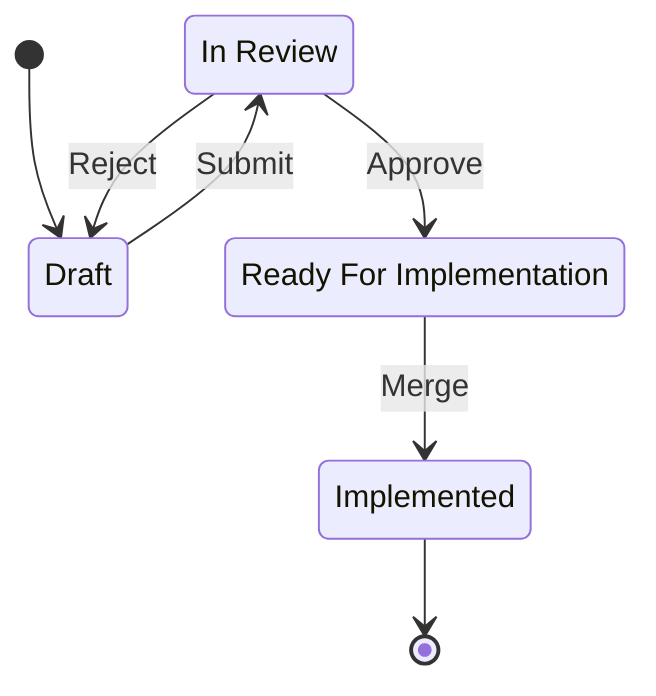

# Guance Cloud Proposal Governance Guidelines

This documentation describes the governance process of the Guance Cloud proposal.
It means all the repositories under the Guance Cloud organization should follow this process to ensure the proposal is well organized and easily understood.

## Principles

- **Openness**: All the proposals should be open to the public.
- **Transparency**: All the decision-making processes should be transparent to the public.
- **Respectful**: Everyone who contributes should be respected.

## Decision Making

Guance Community is an open-source community, so we encourage everyone to contribute to the community.

In this community, the GitHub repository is the single source of truth. All the proposals should be submitted as a pull request to the GitHub repository for the proposed effect.

All decisions can be made as a pull request to change the repository. So the decision-making process is the same as the contribution process.

All decisions affecting the community should be made as a proposal. Following the same steps:

1. Create a pull request to the repository. Anyone can do this.
2. Discuss the proposal in the pull request. Anyone can do this, and the reviewer can add the *LGTM* label to the pull request.
3. If the proposal is accepted, the pull request will be merged. Only the maintainer can do this.

In general, the proposal will pass through the following stages:

- **Draft**: The proposal is just created and needs to be ready for review. But it can be reviewed by anyone. In this stage, anyone can create a pull request named `[WIP] proposal: <proposal name>` to the repository. The `[WIP]` prefix means the proposal is a work in progress. So contributors can discuss the proposal in the pull request. If the proposal is ready for review, the pull request can be renamed to `proposal: <proposal name>`. The maintainers will review the proposal.
- **In Review**: The proposal is ready for review. The maintainers will review the proposal. The [pull request workflow](https://guance.io/contribution-guide/how-to-guides/make-a-pull-request) and [slash command](https://guance.io/contribution-guide/explanations/slash-bot-commands) can be used in this stage. If the proposal is accepted, the pull request will be merged. If the proposal is rejected, the pull request will be closed.
- **Ready For Implementation**: The proposal is accepted and ready for implementation. In this stage, the contributor can create a new pull request named `[WIP] feat: <feature name>` to implement the proposal. If the proposal is implemented, the pull request can be renamed to `feat: <feature name>`.
- **Implemented**: The proposal is implemented. The feature pull request will be closed.

## More about contribution

See the [Contribution Guidelines](https://guance.io/contribution-guide/) and [Code of Conduct](https://github.com/GuanceCloud/community/blob/main/CODE_OF_CONDUCT.md) for more details.
